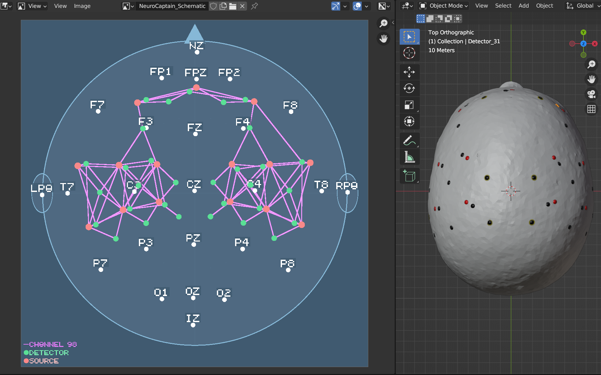
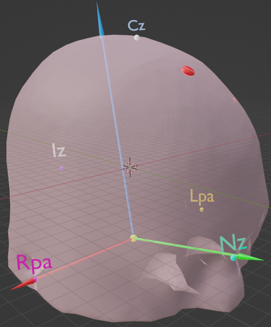
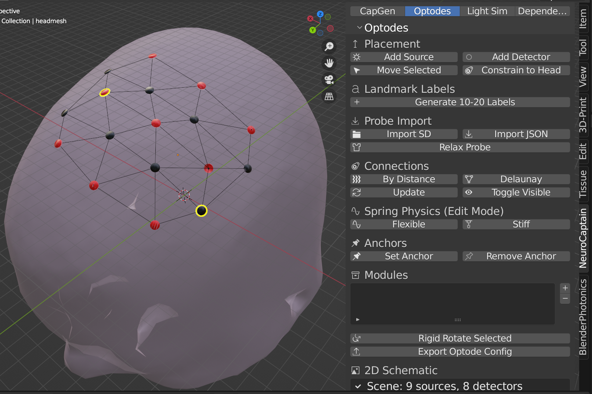
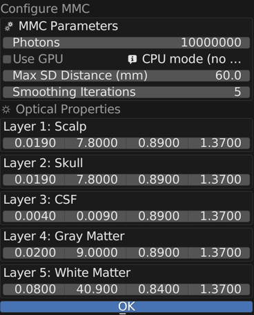
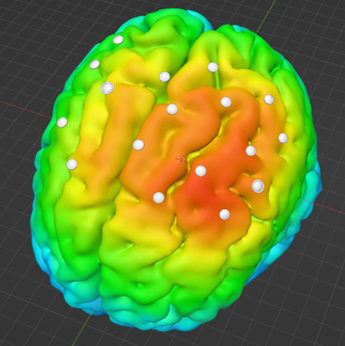

# NeuroCaptain

[](https://github.com/COTILab/NeuroCaptain/actions/workflows/blender-tests.yml)

- **Authors**: Ashlyn McCann (mccann.as@northeastern.edu) and Qianqian Fang (q.fang@neu.edu)
- **License**: GNU General Public License Version 3 (GPLv3)
- **Version**: v2025 (v0.1)
- **Website**: [neurojson.org/NeuroCaptain](http://neurojson.org/NeuroCaptain)
- **Acknowledgment**: This project is supported by NIH awards [R01-EB026998]() and [U24-NS124027](https://reporter.nih.gov/search/dXkcyoaEQkaRrkpQoOnEBw/project-details/10308329).

---

## Table of Contents

- [Introduction](#introduction)
- [Installation](#installation)
  - [1. Install Blender](#1-install-blender)
  - [2. Download NeuroCaptain](#2-download-neurocaptain)
  - [3. Install the add-on in Blender](#3-install-the-add-on-in-blender)
  - [4. Install Python dependencies](#4-install-python-dependencies)
- [Workflow Overview](#workflow-overview)
  - [Head Model Import and Landmarks](#head-model-import-and-landmarks)
  - [Cap Generation](#cap-generation)
  - [Optode Placement](#optode-placement)
  - [Layered Head Models](#layered-head-models)
  - [Light Simulation](#light-simulation)
- [Running Tests](#running-tests)
- [How to Cite](#how-to-cite)
- [License](#license)

---

## Introduction

**NeuroCaptain** is a Blender add-on that turns a 3D head model into a 3D-printable optode cap for fNIRS/EEG neuroimaging, and can additionally simulate light propagation through a segmented head model to help design and validate a probe layout. It builds on **Iso2Mesh** for mesh processing and Monte Carlo photon simulation (**pmmc**), and on **RedbirdPy** for finite-element diffuse optical forward modeling, all driven from Blender's native tools and `bpy` API - no MATLAB/Octave installation required.

Users can select a head model from the built-in atlas library or import a custom model, then define optode/landmark positions with three methods:

- **Automatic calculation** of standard 10-20, 10-10, or 10-5 system landmarks.
- **Custom layout generation** by manually selecting vertices.
- **Custom geometry labeling** by importing a user-defined geometry.

The landmark geometry is integrated into the head surface using Blender's procedural modeling tool, **Geometry Nodes**. Once landmarks are placed, a wireframe head cap is generated through edge extraction and thickness adjustment - all achievable with a single click - resulting in a ready-to-print 3D model.

Beyond cap generation, NeuroCaptain can import a segmented (multi-layer) head volume, place sources/detectors on the scalp, and run a light-transport simulation (mesh-based Monte Carlo via `pmmc`, or a FEM forward solve via `redbirdpy`) to visualize brain sensitivity for a given probe layout.

If you use NeuroCaptain in your research, please cite:

> Ashlyn McCann, Edward Xu, Fan-Yu Yen, Noah Joseph, and Qianqian Fang,
> *"Creating anatomically derived, standardized, customizable, and three-dimensional printable head caps for functional neuroimaging,"*
> Neurophotonics, 12(1), 015016 (2025).
> [https://doi.org/10.1117/1.NPh.12.1.015016](https://doi.org/10.1117/1.NPh.12.1.015016)

---

## Installation

### 1. Install Blender

Download and install [Blender](https://www.blender.org/download/) 3.6 or later. NeuroCaptain is tested via continuous integration on Blender **3.6, 4.2, and 5.0** across Windows, macOS, and Linux (see the badge above).

### 2. Download NeuroCaptain

On the [NeuroCaptain GitHub page](https://github.com/COTILab/NeuroCaptain), click **Code > Download ZIP** (or `git clone` the repository). Leave it as a ZIP file - don't unzip it, Blender does that for you in the next step.

### 3. Install the add-on in Blender

1. Open Blender and go to `Edit > Preferences > Add-ons`.
2. Click the dropdown in the top-right corner and select **Install from Disk...** (Blender 4.2+) or click **Install...** (older versions).
3. Select the `NeuroCaptain-master.zip` (or similarly named) file you downloaded and confirm.
4. Enable the checkbox next to **NeuroCaptain** in the add-on list.
5. A new **NeuroCaptain** tab appears in the 3D Viewport's sidebar (press `N` to show the sidebar if it's hidden).

### 4. Install Python dependencies

NeuroCaptain needs a few Python packages (`numpy`, `scipy`, `jdata`, `iso2mesh`, `pmcx`, `pmmc`, `redbirdpy`) to be installed into Blender's own bundled Python - you do **not** need a separate Python installation. This is handled from inside the add-on itself:

1. Open the **NeuroCaptain** tab in the 3D Viewport sidebar and go to the **Dependencies** sub-panel.
2. Click **Install All** to install everything at once, or install individual packages (**JData**, **NumPy**, **SciPy**, **iso2mesh**, **pmmc**, **redbirdpy**) one at a time.
3. Click **Check** at any point to see which dependencies are still missing.

---

## Workflow Overview

### Head Model Import and Landmarks

Select a head model from the built-in atlas library (or import your own), then compute standard 10-20/10-10/10-5 landmarks automatically - anchored to the Nz/Iz/Lpa/Rpa/Cz reference points - or place custom landmarks by hand.



### Cap Generation

With landmarks placed, NeuroCaptain cuts landmark holes into the head surface with **Geometry Nodes**, decimates the mesh for a manageable face count, and extracts a wireframe cap shape (`Place Cutouts` + `Boolean Cut`) that can be exported as a dual (polygonal) mesh ready for 3D printing.

### Optode Placement

Add sources and detectors directly onto the head surface (each snapped/shrinkwrapped to the mesh), or import a probe layout from an SD file or JSON. Optodes can be connected by distance threshold or Delaunay triangulation, relaxed with spring physics, anchored in place, and grouped into reusable modules. A live 2D schematic view mirrors the 3D layout as you work.



### Layered Head Models

Import a segmented head volume (`.mat`, `.jmsh`, `.bmsh`, or `.json`) for use in light simulation. NeuroCaptain supports both the standard 5-layer scalp/skull/CSF/gray-matter/white-matter convention, and an arbitrary layer count via the flexible importer, which reads layer names embedded in the mesh file or a sidecar JSON, or prompts you to name each detected layer.

### Light Simulation

Configure and run a mesh-based Monte Carlo simulation (`pmmc`) or a FEM forward solve (`redbirdpy`) over the imported layered head model and placed optodes, to visualize brain sensitivity for the current probe layout.




---

## Running Tests

NeuroCaptain ships a headless test suite that runs inside Blender itself:

```bash
blender --background --factory-startup --python-exit-code 1 --python tests/run_tests.py
```

This is the same command run by the [GitHub Actions workflow](.github/workflows/blender-tests.yml) on every push, across Blender 3.6/4.2/5.0 and Windows/macOS/Linux. See `tests/` for the individual test modules.

---

## How to Cite

If you use NeuroCaptain in your research, please cite:

> Ashlyn McCann, Edward Xu, Fan-Yu Yen, Noah Joseph, and Qianqian Fang,
> *"Creating anatomically derived, standardized, customizable, and three-dimensional printable head caps for functional neuroimaging,"*
> Neurophotonics, 12(1), 015016 (2025).
> [https://doi.org/10.1117/1.NPh.12.1.015016](https://doi.org/10.1117/1.NPh.12.1.015016)

---

## License

GNU General Public License v3.0 or later.

## Author

**Ashlyn McCann** (mccann.as@northeastern.edu)
**Qianqian Fang** (q.fang@neu.edu)
Computational Optics & Translational Imaging (COTI) Lab, Northeastern University
